<a href="https://hrabovskyi.online">
  <picture>
    <source media="(prefers-color-scheme: dark)" srcset="assets/header-dark.svg">
    
  </picture>
</a>

  
  
  
  

By day I build trade and payment flows, reconciliation and third-party integrations for a European crypto brokerage. After hours I run everything I make on one Hetzner box, deployed from Git, and write about the parts that went wrong.

<!-- box:start -->
<picture><source media="(prefers-color-scheme: dark)" srcset="assets/box-dark.svg"></picture>
<!-- box:end -->

  <a href="https://github.com/Egoushka/attest"><picture><source media="(prefers-color-scheme: dark)" srcset="assets/card-attest-dark.svg"></picture></a>
  <a href="https://github.com/Egoushka/chargehand"><picture><source media="(prefers-color-scheme: dark)" srcset="assets/card-chargehand-dark.svg"></picture></a>
  <a href="https://github.com/Egoushka/chronicle"><picture><source media="(prefers-color-scheme: dark)" srcset="assets/card-chronicle-dark.svg"></picture></a>
  <a href="https://github.com/nytka-app/server"><picture><source media="(prefers-color-scheme: dark)" srcset="assets/card-server-dark.svg"></picture></a>
  <a href="https://github.com/Egoushka/switchboard"><picture><source media="(prefers-color-scheme: dark)" srcset="assets/card-switchboard-dark.svg"></picture></a>
  <a href="https://github.com/Egoushka/devbox-mcp"><picture><source media="(prefers-color-scheme: dark)" srcset="assets/card-devbox-mcp-dark.svg"></picture></a>

<picture>
  <source media="(prefers-color-scheme: dark)" srcset="assets/stack-dark.svg">
  
</picture>

### Latest writing

<!-- posts:start -->
- `29 Sep` &nbsp;[My agent orchestrator lost its first blind test, 0.333 to 0.667](https://hrabovskyi.online/writing/chargehand-blind-test/)
- `29 Sep` &nbsp;[My search scored 48.2% on its first eval. Then I found the scoreboard was wrong twice.](https://hrabovskyi.online/writing/chronicle-vs-grep/)
- `29 Sep` &nbsp;[My private services were on the public internet. DNS was the only thing hiding them.](https://hrabovskyi.online/writing/dns-is-not-access-control/)
- `29 Sep` &nbsp;[Making this repo public would have published my server's address in 203 commits](https://hrabovskyi.online/writing/making-a-repo-public/)
- `22 Sep` &nbsp;[The library rejected all 36 million valid Hungarian tax numbers](https://hrabovskyi.online/writing/attest/)
<!-- posts:end -->

<picture>
  <source media="(prefers-color-scheme: dark)" srcset="assets/snake-dark.svg">
  
</picture>

The cards redraw daily from <a href="https://hrabovskyi.online/status.json">status.json</a>, written by cron on the box. <a href="https://github.com/Egoushka/Egoushka/blob/main/scripts/render.py">How</a>.
